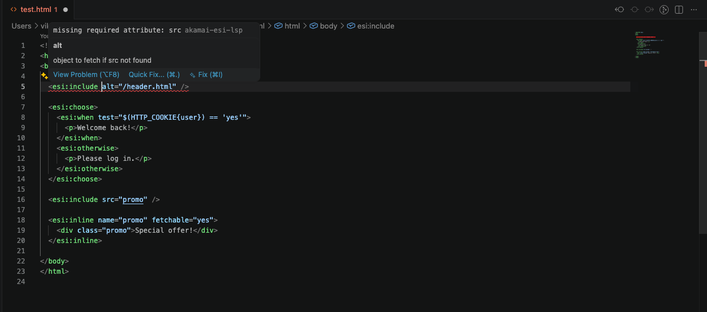
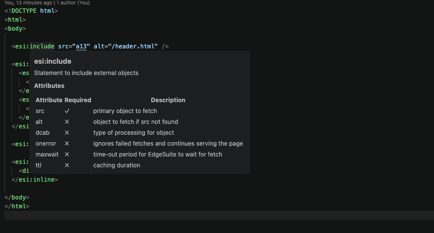
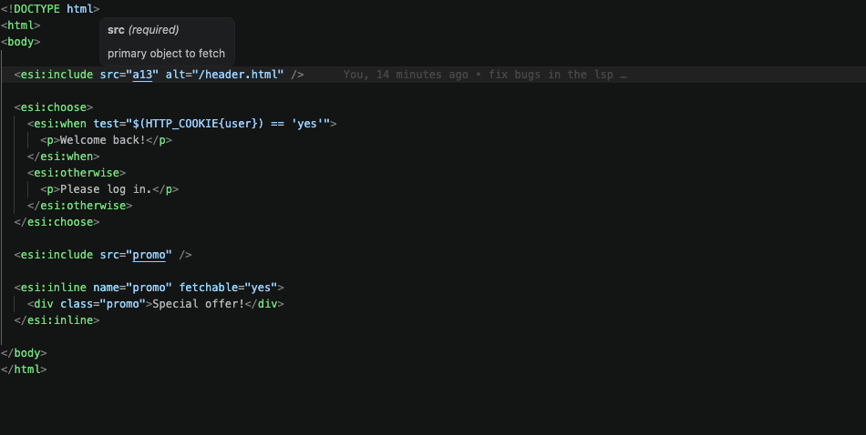
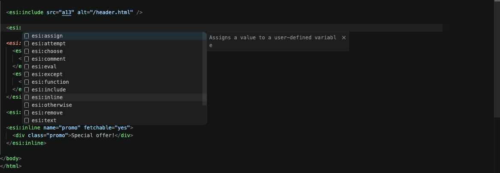
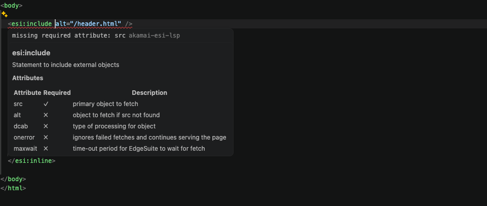
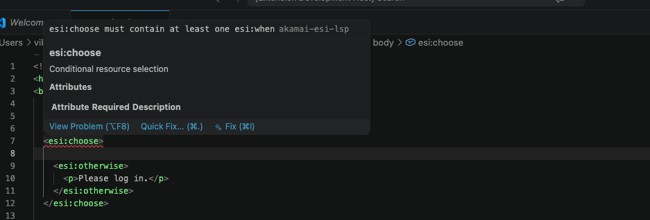
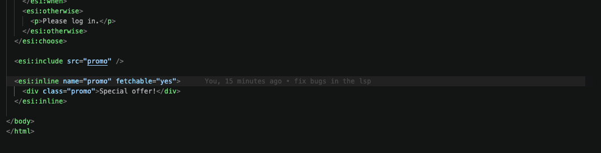

# akamai-esi-lsp

A Language Server Protocol (LSP) implementation for **Akamai ESI (Edge Side Includes)**, written in Go.

ESI has no RFC — this server targets the **Akamai ESI dialect specifically**, based on Akamai's official documentation.

> ⚠️ **This is an early v0.1 implementation.** Support is intentionally limited. Please read the [limitations section](#️-important-current-support-limitations) before using in production workflows.

<!-- TODO: add screenshot of VS Code with ESI file open showing all features -->


---

## Features

| Feature                     | Status                                |
|-----------------------------|---------------------------------------|
| Diagnostics / validation    | ✅ Basic — see limitations below      |
| Autocomplete / IntelliSense | ✅ Basic — common tags and attrs only |
| Hover documentation         | ✅ Basic — common tags and attrs only |
| Go-to-definition            | ✅ `esi:include` → `esi:inline` only  |
| Full attribute coverage     | 📋 Planned for v0.2                   |
| Syntax variations support   | 📋 Planned for v0.2                   |
| Expression validation       | 📋 Planned for v0.3                   |
| Cross-file definition       | 📋 Planned for v0.3                   |
| Syntax highlighting         | 📋 Planned for v0.3                   |

---

## Screenshots

### Hover Documentation




### Autocomplete
<!-- TODO: add screenshot of completion list after typing <esi: -->



### Diagnostics
<!-- TODO: add screenshot of red squiggly on missing required src attribute -->





### Go-to-Definition
<!-- TODO: add screenshot of F12 jumping from esi:include src="promo" to esi:inline -->

By pressing F12, when on esi:include src="promo", the cursor will move to the promo's definition



---

## ⚠️ Important: Current Support Limitations

This is an early v0.1 implementation. Support is intentionally limited.

### Tag coverage
Only the 15 tags listed below are recognised. Akamai ESI has additional tags
and extensions not yet implemented.

### Attribute coverage
Even for supported tags, attribute validation is incomplete — only the most
commonly used attributes are covered. Many valid Akamai attributes will be
flagged as unknown or silently ignored.

### Tag syntax variations
Akamai ESI supports multiple forms of the same tag in practice — longform,
shortform, and alternate attribute combinations. For example:

```html
<!-- these are all valid Akamai ESI but only some forms are recognised -->
<esi:include src="/header.html" />               ✓ supported
<esi:include src="/header.html" dca="esi" />     dca not validated
<esi:assign name="x" value="y" />               ✓ supported
<esi:assign name="x">some value</esi:assign>    block form not supported
```

The parser handles the most common patterns seen in production ESI files.
Edge cases, nested expressions, and alternate syntax forms may parse
incorrectly or be silently ignored.

### ESI variable expressions
Variables like `$(HTTP_COOKIE{name})` are recognised in completions but
their syntax is not validated. Complex expressions, string functions, and
operator combinations inside `test` attributes are not checked.

### What this means in practice
- Use diagnostics as a guide, not a guarantee
- A clean diagnostic result does not mean your ESI is valid on Akamai
- An unknown attribute warning does not always mean the attribute is wrong
- Always test your ESI against an actual Akamai environment

These limitations will be addressed incrementally. See the [roadmap](#post-mvp-roadmap) below.

---

## Supported ESI Tags

| Tag                  | Description                                      |
|----------------------|--------------------------------------------------|
| `<esi:include>`      | Fetch and include another resource               |
| `<esi:remove>`       | Remove content at ESI processing time            |
| `<esi:comment>`      | ESI-only comment, stripped at processing         |
| `<esi:vars>`         | Evaluate ESI variables in a block                |
| `<esi:assign>`       | Assign a value to a variable                     |
| `<esi:eval>`         | Evaluate another ESI page inline                 |
| `<esi:choose>`       | Conditional container                            |
| `<esi:when>`         | Branch within `esi:choose`                       |
| `<esi:otherwise>`    | Default branch within `esi:choose`               |
| `<esi:try>`          | Error-handling container                         |
| `<esi:attempt>`      | Primary branch within `esi:try`                  |
| `<esi:except>`       | Fallback branch within `esi:try`                 |
| `<esi:inline>`       | Define an inline ESI fragment                    |
| `<esi:function>`     | Reusable ESI function (Akamai extension)         |
| `<esi:text>`         | Raw text block, no ESI processing inside         |

## Supported ESI Variables

| Variable                  | Description                    |
|---------------------------|--------------------------------|
| `$(HTTP_COOKIE{name})`    | Cookie value by name           |
| `$(QUERY_STRING{name})`   | Query string parameter         |
| `$(HTTP_HOST)`            | Request Host header            |
| `$(REQUEST_PATH)`         | Request path                   |
| `$(REQUEST_METHOD)`       | HTTP method                    |
| `$(HTTP_ACCEPT_LANGUAGE)` | Accept-Language header         |
| `$(GEO{country_code})`    | Akamai GeoIP country           |
| `$(GEO{region_code})`     | Akamai GeoIP region            |
| `$(USER_AGENT)`           | User-Agent string              |

---

## Prerequisites

- Go 1.22+
- Node.js 18+ and npm (for the VS Code extension)
- VS Code

---

## Installation

### 1. Clone and build

```bash
git clone https://github.com/vikranthBala/esi-lsp
cd esi-lsp
make build
```

### 2. Set up the VS Code extension

```bash
make extension
```

### 3. Run in VS Code

Open the project in VS Code and press `F5` to launch the Extension Development Host.
Open any `.html` or `.esi` file to activate the server.

---

## Development Guide

### Project structure

```
akamai-esi-lsp/
├── cmd/
│   └── esi-lsp/
│       └── main.go                 # Binary entry point
├── internal/
│   ├── server/
│   │   └── server.go               # LSP JSON-RPC layer — routes all LSP methods
│   ├── parser/
│   │   ├── ast.go                  # AST node types, Position, Range, helpers
│   │   └── parser.go               # Fault-tolerant ESI parser
│   ├── analyzer/
│   │   ├── analyzer.go             # Validation rules and diagnostic logic
│   │   └── rules_gen.go            # Generated tag metadata — DO NOT EDIT manually
│   ├── completion/
│   │   └── completion.go           # Autocomplete engine
│   ├── hover/
│   │   └── hover.go                # Hover documentation
│   └── definition/
│       └── definition.go           # Go-to-definition handler
├── vscode-extension/               # VS Code client (TypeScript)
│   ├── package.json
│   ├── tsconfig.json
│   ├── language-configuration.json
│   └── src/
│       └── extension.ts            # Launches the Go binary as LSP client
├── tools/
│   └── gen_tags/
│       ├── main.go                 # Go code generator — reads tags.json → rules_gen.go
│       └── extract.py              # Python script — extracts metadata from Akamai PDF
├── testdata/                       # Sample ESI files for manual testing
│   └── test.html
├── Makefile
└── README.md
```

### Common commands

```bash
make build      # build the language server binary
make test       # run all tests
make extension  # compile the VS Code extension
make gen        # regenerate tag rules from tags.json
make clean      # remove all build artifacts
make build-all  # cross-compile for all platforms
```

### Updating tag metadata

Tag metadata (attributes, descriptions, summaries) lives in
`internal/analyzer/rules_gen.go`. It is generated from `tools/gen_tags/tags.json`
using a local LLM pipeline:

```bash
# 1. Edit tools/gen_tags/tags.json manually, or
#    run the Python extraction script against the Akamai ESI PDF:
cd tools/gen_tags
python extract.py   # requires Ollama running locally with mistral

# 2. Regenerate the Go source
make gen
```

> Note: `rules_gen.go` is committed to the repo. You only need to regenerate
> if you are updating tag metadata. Ollama and the PDF are not required to
> build or run the server.

### Adding a new LSP feature

1. Implement the feature in `internal/<feature>/<feature>.go`
2. Add a handler method in `internal/server/server.go`
3. Declare the capability in `handleInitialize`
4. Add the method name to the `handle` switch

### Running the server manually

The server communicates over stdin/stdout. You can verify it starts correctly:

```bash
./esi-lsp
# should log: "Starting akamai-esi-lsp server..." to stderr
```

---

## How it works

### Two-phase fault-tolerant parsing

ESI is embedded inside HTML that is often not well-formed XML. A strict XML
parser would reject the surrounding document. We use a two-phase approach:

1. **Scan** the raw source for `<esi:` patterns to find candidate positions
2. **Tokenize** the extracted ESI fragments using Go's `encoding/xml`
3. **Track byte offsets** throughout to produce accurate `line:character`
   ranges for all LSP responses

The surrounding HTML never touches the XML tokenizer — invalid DOCTYPE
declarations, void elements, unquoted attributes — none of it matters.

### Cancellation-aware parsing

Every `didChange` event schedules a new parse and cancels the previous one.
This ensures diagnostics always reflect the latest document state, even
during fast typing. Stale results from earlier keystrokes are discarded.

### Metadata pipeline

Tag documentation is extracted from the official Akamai ESI PDF using a
local LLM (Mistral via Ollama), producing structured JSON that is
code-generated into Go source. Updating the LSP's knowledge base is a
single `make gen` command.

---

## Post-MVP Roadmap

### v0.2
- Full attribute coverage per Akamai ESI reference documentation
- Longform and shortform tag syntax variations
- Block form attribute support (e.g. `<esi:assign name="x">value</esi:assign>`)
- Filter already-typed attributes from completion suggestions

### v0.3
- Syntax highlighting via TextMate grammar for `.esi` and ESI blocks in HTML
- Cross-file go-to-definition — follow `src="/fragments/file.html"` to disk
- Expression validation inside `test` attributes
- Content validation — detect non-ESI content inside `esi:choose`

### v1.0
- Full Akamai ESI dialect coverage
- Workspace-aware server — track all ESI files in a project
- VSIX packaging for one-click install from VS Code marketplace

---

## Contributing

1. Fork the repo
2. Create a feature branch: `git checkout -b feature/my-feature`
3. Run `make test` before opening a PR
4. Open a pull request — all contributions welcome

---

## Credits

Built by [Vikranth Bala](https://github.com/vikranthBala).

Developed collaboratively with [Claude](https://claude.ai) (Anthropic) — architectural
design, pair programming, and debugging across the full implementation:
fault-tolerant parser, cancellation-aware scheduling, LSP protocol layer,
and metadata extraction pipeline.

---

## License

MIT
